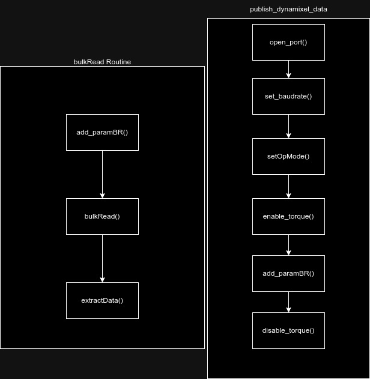

# ros_dynamixel

[http://docs.ros.org/en/noetic/api/dynamixel_sdk/html/namespacedynamixel.html](http://docs.ros.org/en/noetic/api/dynamixel_sdk/html/namespacedynamixel.html)

the two most important methods when working with multiple dynamixel motors are:

1. bulkRead/ bulkWrite methods -  The class for reading/writing multiple Dynamixel data from/to different addresses with different lengths at once.The functions that are related with the Bulkwrite and the Bulkread function handle the number of items which are not near each other in the Dynamixel control table on multiple DYNAMIXEL’s
2. syncRead/ syncWrite methods - The class for reading/writing multiple Dynamixel data from/to same address with same length at once. The funtions that are related with the Syncread and Syncwrite handle the number of items which are near each other in the Dynamixel control table on multiple DYNAMIXEL’s, such as the goal position and the goal velocity. They can access multiple dynamixels’s registers at once

